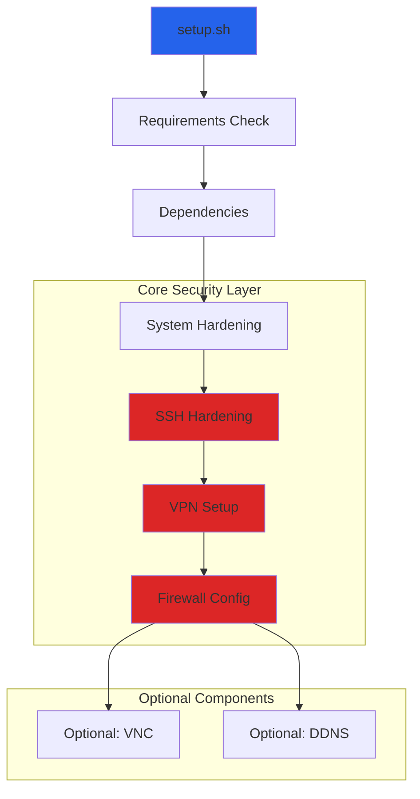
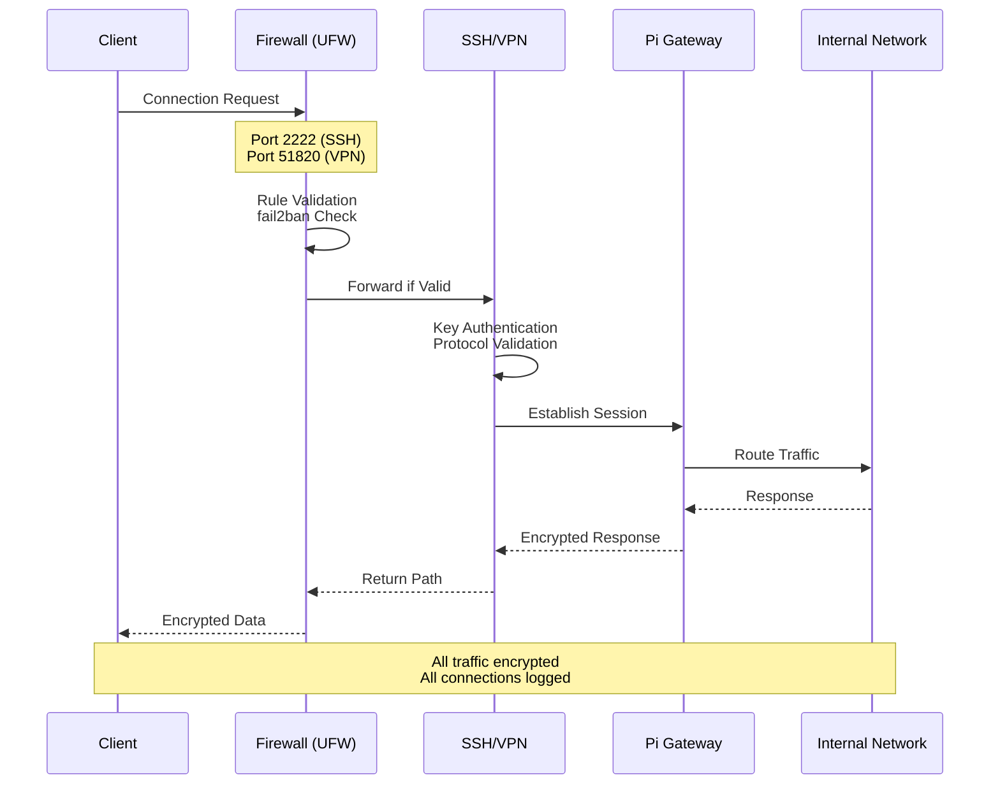

# Building a Secure Remote Access Gateway for Raspberry Pi: Architecture and Design Lessons

## Introduction

Remote access to home infrastructure presents a fundamental security challenge. Most solutions fall into two camps: overly complex enterprise VPN setups requiring significant expertise, or consumer-grade remote desktop tools that sacrifice security for convenience. Pi Gateway addresses this gap by providing a security-first remote access solution that can be deployed in under 10 minutes on commodity Raspberry Pi hardware.

At its core, Pi Gateway transforms a Raspberry Pi into a hardened access gateway with three key capabilities: secure SSH access, WireGuard VPN connectivity, and defense-in-depth firewall protection. The design philosophy centers on security defaults, minimal attack surface, and operational simplicity.

## The Problem Space

Setting up secure remote access typically requires coordinating multiple components: SSH hardening, VPN configuration, firewall rules, fail2ban setup, key management, and dynamic DNS. Each component has its own configuration syntax, security considerations, and failure modes. Most engineers spend hours researching best practices, then more time debugging configuration interactions.

We designed Pi Gateway to solve this coordination problem while maintaining three core principles:

1. **Security by default**: Every component should ship with production-grade hardening
2. **Idempotent operations**: Scripts can run multiple times safely without side effects
3. **Observable behavior**: Clear logging and dry-run modes for validation before changes

## Why This Approach

The traditional approach to remote access configuration involves manually configuring each service, reading documentation for multiple tools, and hoping the interaction between components is secure. This creates several failure modes:

- SSH running on default port 22 becomes a brute-force target
- VPN configurations often lack proper firewall rules
- Key management becomes ad-hoc and inconsistent
- Updates to one component can break others

Pi Gateway uses a modular architecture where each security component is independently configurable but designed to work together. The shell script foundation provides transparency - users can inspect exactly what changes will be made to their system. Combined with comprehensive testing (40 unit tests with 100% pass rate), this creates a trustworthy automation layer.

## Architecture Overview

The system follows a phase-based orchestration model where each security component is a self-contained module with standardized interfaces:



Each phase is implemented as an independent bash script in the `scripts/` directory. The master orchestrator (`setup.sh`) coordinates execution, handles failures, and maintains state. This design allows users to run individual components or compose them based on requirements.

### Request Flow Architecture

When a remote client connects to the gateway, traffic flows through multiple security layers:



## Key Design Decisions

### Shell Scripts Over Configuration Management

We chose bash scripts over tools like Ansible or Terraform for several reasons:

**Transparency**: Users can read the exact commands that will execute. There's no abstraction layer hiding behavior.

**Dependencies**: Zero external dependencies beyond standard Unix tools. No Python, Ruby, or agent installation required.

**Debugging**: When something fails, the error is a shell command, not a domain-specific language construct. Standard Unix debugging tools apply.

The tradeoff is maintaining shell script best practices: strict error handling (`set -euo pipefail`), comprehensive testing, and consistent patterns across modules.

### Dry-Run First Development

Every script supports a `DRY_RUN` mode that simulates changes without modifying the system. This serves three purposes:

1. **User confidence**: Test the full setup process before making changes
2. **Development safety**: Develop and test on production-like environments
3. **Documentation**: The dry-run output serves as inline documentation of operations

Implementation uses a consistent wrapper pattern:

```bash
execute_command() {
    local cmd="$1"
    local description="${2:-}"

    if [[ "$DRY_RUN" == "true" ]]; then
        echo "[DRY-RUN] $description"
        echo "[DRY-RUN] $cmd"
        return 0
    else
        eval "$cmd"
    fi
}
```

### Modular Security Components

Each security component (SSH, VPN, firewall) is implemented as a standalone script with standardized structure:

- Configuration validation
- Backup of existing configs
- Atomic changes with rollback capability
- Service health verification
- Connection information display

This modularity enables several workflows:

- Full installation: All components in sequence
- Core security: SSH + VPN + Firewall only
- Custom selection: Interactive component choice
- Individual updates: Re-run single components

### Defense in Depth

Security doesn't rely on any single component. Multiple layers provide protection:

**Network Layer**: UFW firewall with strict default-deny rules, custom port configuration, fail2ban for intrusion detection.

**Transport Layer**: WireGuard VPN with modern cryptography (Curve25519, ChaCha20, Poly1305), per-client key isolation.

**Application Layer**: SSH with key-only authentication, disabled root login, restricted algorithms to modern ciphers.

**System Layer**: Kernel hardening via sysctl, disabled unnecessary services, restricted file permissions.

A breach in one layer doesn't compromise the system. An attacker must defeat multiple independent security controls.

## Implementation Details

### SSH Hardening

The SSH configuration demonstrates the security-first approach. Instead of starting with defaults and incrementally hardening, we define a secure baseline:

```bash
# Key excerpts from scripts/ssh-setup.sh

# Only strong key exchange algorithms
KexAlgorithms curve25519-sha256@libssh.org,diffie-hellman-group16-sha512

# Modern ciphers only
Ciphers chacha20-poly1305@openssh.com,aes256-gcm@openssh.com

# Authentication hardening
PermitRootLogin no
PasswordAuthentication no
MaxAuthTries 3
LoginGraceTime 30
```

The setup script handles the full lifecycle: backing up existing configs (timestamped in `/etc/pi-gateway/backups/`), generating Ed25519 keys, configuring the daemon, testing the configuration with `sshd -t`, and restarting the service with verification.

### WireGuard VPN Architecture

WireGuard setup focuses on operational simplicity without sacrificing security. The VPN network uses a dedicated subnet (10.13.13.0/24) isolated from the primary network:

```bash
# Automated client management
# scripts/vpn-client-manager.sh

# Add a new client
./scripts/vpn-client-manager.sh add laptop

# Automatically:
# - Generates unique key pair
# - Assigns next available IP
# - Updates server configuration
# - Creates client config file with QR code
# - Outputs connection instructions
```

The server configuration includes proper NAT and forwarding rules that are atomically applied and removed with the interface:

```bash
PostUp = iptables -t nat -A POSTROUTING -o eth0 -j MASQUERADE
PostDown = iptables -t nat -D POSTROUTING -o eth0 -j MASQUERADE
```

This ensures the VPN doesn't leave orphaned iptables rules if the service crashes or is manually stopped.

### Firewall Configuration

The firewall uses UFW (Uncomplicated Firewall) for rule management, but the simplicity is deceptive. The configuration implements strict default-deny with explicit allowances:

```bash
# Default policies
ufw default deny incoming
ufw default allow outgoing

# Explicit allowances
ufw allow 2222/tcp    # SSH on custom port
ufw allow 51820/udp   # WireGuard VPN
```

Integration with fail2ban adds dynamic IP blocking for failed authentication attempts. The configuration monitors both SSH and VPN authentication logs, automatically blocking IPs after configurable thresholds.

## Testing Strategy

The testing infrastructure mirrors the modular architecture. We use BATS (Bash Automated Testing System) for unit tests, Docker for integration tests, and QEMU for hardware emulation:

```bash
# Unit tests validate individual functions
# tests/unit/vpn-setup.bats

@test "VPN configuration creates correct network" {
  DRY_RUN=true ./scripts/vpn-setup.sh

  # Verify network configuration
  grep -q "10.13.13.0/24" /tmp/test-config/wg0.conf
}

# Integration tests use Docker
# tests/docker/e2e-test.sh

docker run --privileged \
  -v "$PWD:/workspace" \
  debian:bookworm \
  /workspace/setup.sh --dry-run

# QEMU tests use full Pi emulation
# tests/qemu/run-pi-vm.sh

qemu-system-aarch64 \
  -M raspi3b \
  -kernel kernel.img \
  -dtb bcm2710-rpi-3-b-plus.dtb
```

The 40-test suite covers:

- Configuration parsing and validation
- Dry-run mode completeness
- Idempotent execution
- Error handling and rollback
- Service health verification
- Mock hardware simulation

## Real-World Usage Patterns

### Home Lab Gateway

The primary use case: secure access to a home lab environment. A typical deployment:

1. Fresh Raspberry Pi 4 with Pi OS Lite
2. Run quick-install script: `curl -sSL https://raw.githubusercontent.com/.../quick-install.sh | bash`
3. Configure router port forwarding: 2222 → Pi IP, 51820 → Pi IP
4. Add VPN clients: `sudo wg-add-client phone`
5. Connect from anywhere with WireGuard client

The gateway provides access to internal services without exposing them directly to the internet. All external connections terminate at the hardened Pi gateway.

### Jump Box for IoT Networks

Some users deploy Pi Gateway as a jump box for IoT device management. IoT devices sit on an isolated VLAN, accessible only through the VPN. This prevents direct internet exposure while maintaining remote management capability.

### Development Environment Access

Developers use Pi Gateway to access home development servers. The SSH + VPN combination provides secure shell access and full network connectivity for services like databases, message queues, and development web servers.

## Operational Considerations

### State Management

Pi Gateway maintains minimal state. Most configuration is stored in standard system locations (`/etc/ssh/`, `/etc/wireguard/`), making it compatible with existing backup and configuration management tools.

Backups are automatically created before changes, timestamped in `/etc/pi-gateway/backups/`. This enables rollback by simply copying previous configurations and restarting services.

### Logging and Observability

All operations log to both stdout and persistent log files in `/var/log/pi-gateway/`. The log format is structured for easy parsing:

```bash
2025-09-16 14:23:15 - INFO: Starting SSH hardening
2025-09-16 14:23:16 - SUCCESS: Generated Ed25519 key pair
2025-09-16 14:23:17 - INFO: Configuring SSH daemon
```

Service status is monitored through systemd, with health checks verifying both process state and actual functionality (e.g., SSH accepting connections on the configured port).

### Updates and Maintenance

The modular design supports surgical updates. Need to rotate VPN keys? Re-run just the VPN setup script. Want to update SSH ciphers? Run only the SSH hardening module.

System package updates are handled by the underlying OS. Pi Gateway scripts detect and work with existing installations, upgrading configurations as needed.

## Security Model

The threat model assumes:

- Network attacker with ability to scan and probe exposed ports
- Compromised credentials or keys (mitigated by key-only auth, rate limiting)
- Exploits in exposed services (mitigated by minimal attack surface)

The model does not protect against:

- Physical access to the Pi hardware
- Compromise of the Dynamic DNS account
- Compromise of a trusted VPN client device

Defense in depth means even if SSH or WireGuard has a vulnerability, the attacker still faces firewall rules, system hardening, and limited privilege escalation paths.

## Lessons Learned

### Shell Scripts Scale Differently Than Code

Maintaining bash scripts requires different practices than application code. We learned:

- Strict mode (`set -euo pipefail`) must be on every script
- Shellcheck must be part of CI, not optional
- Quoting variables correctly is critical (`"$var"` not `$var`)
- Testing requires mocking system commands, not just functions

### Dry-Run Mode Is Not Optional

Initially dry-run was an afterthought. Making it a first-class feature required extra work but paid dividends:

- Developers test locally without requiring Pi hardware
- Users validate changes before committing
- Documentation stays in sync with behavior
- Reduced support burden from failed installations

### Configuration Validation Saves Support Time

Early versions assumed users would provide valid input. Adding validation at configuration parse time eliminated entire classes of support issues:

- Port conflicts detected before attempting service start
- Invalid IP ranges caught during VPN client addition
- Unsupported OS versions identified in preflight checks

### Testing Shell Scripts Requires Different Tools

Standard unit testing frameworks don't work well for shell scripts. BATS provided the right abstraction level - tests are still shell scripts, but with structure and assertion helpers. Docker and QEMU testing caught environment-specific issues unit tests couldn't.

## When to Use Pi Gateway

Pi Gateway is appropriate when you need:

- Secure remote access to a home network
- VPN server on lightweight hardware
- Learning platform for security concepts
- Foundation for home automation or media server access

It's not appropriate when you need:

- High-throughput VPN (WireGuard on Pi 4 maxes around 200-300 Mbps)
- Enterprise-grade high availability (no failover, single point of failure)
- Complex network routing scenarios
- Multi-site VPN mesh (supports hub-and-spoke only)

## Future Directions

The modular architecture enables several extensions without core changes:

**Multi-factor authentication**: Integration with TOTP or hardware keys for SSH and VPN.

**Certificate-based VPN**: Option to use X.509 certificates instead of pre-shared keys for larger deployments.

**Monitoring integration**: Export metrics to Prometheus, Grafana, or other observability platforms.

**Automatic security updates**: Automated testing and deployment of security patches.

The `extensions/` directory already contains experimental implementations for container orchestration, web dashboards, and cloud backup integration.

## Conclusion

Building secure remote access infrastructure doesn't require enterprise-grade solutions or extensive security expertise. Pi Gateway demonstrates that well-designed automation with security defaults can make production-grade configurations accessible to anyone with a Raspberry Pi.

The key insights:

- Shell scripts provide transparency and zero dependencies when properly tested
- Dry-run modes build user confidence and enable safe development
- Modular architecture allows composition and independent updates
- Defense in depth provides resilience against single component failure
- Comprehensive testing catches issues before deployment

The entire system runs on $50 of hardware and installs in 10 minutes, yet provides security comparable to enterprise VPN appliances costing thousands of dollars. This is the power of open source security tooling combined with thoughtful automation.

For teams building similar infrastructure automation, the patterns here apply broadly: modular design, comprehensive testing, dry-run modes, and security-first defaults. The specific tools matter less than the architectural principles.

Pi Gateway is available at https://github.com/1mb-dev/pi-gateway under the MIT license. The codebase demonstrates that secure systems don't require complexity - they require careful design and thorough execution.

---

*Vinay Kumar is a technical architect specializing in security infrastructure and distributed systems. This article is based on the development of Pi Gateway v1.2.0, which has passed comprehensive end-to-end testing and is approved for production deployment.*
